# TMall

### 项目截图

> 购物车：

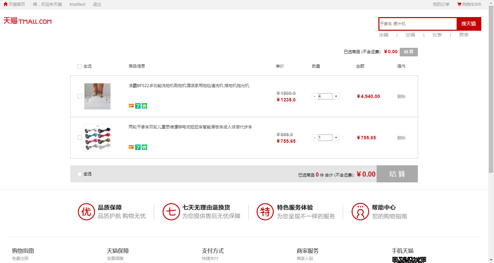

> 产品类别：

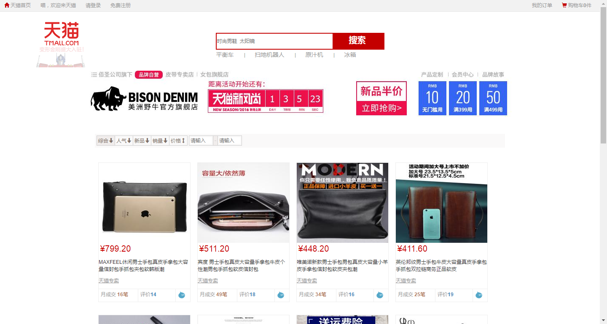

> 确认订单：

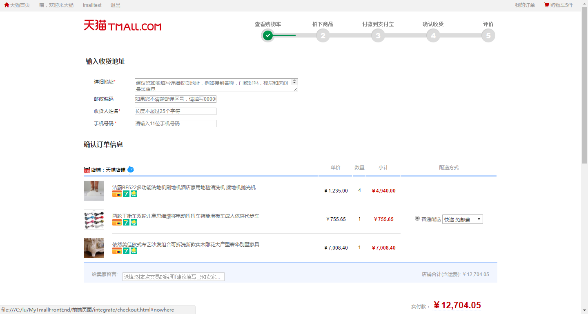

> 评论：

> 通用布局：

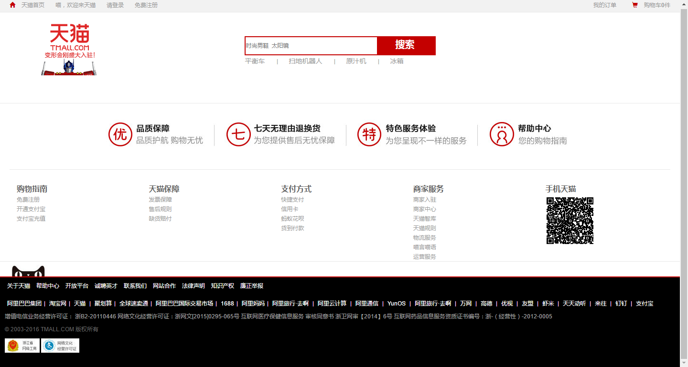

> 确认收货：

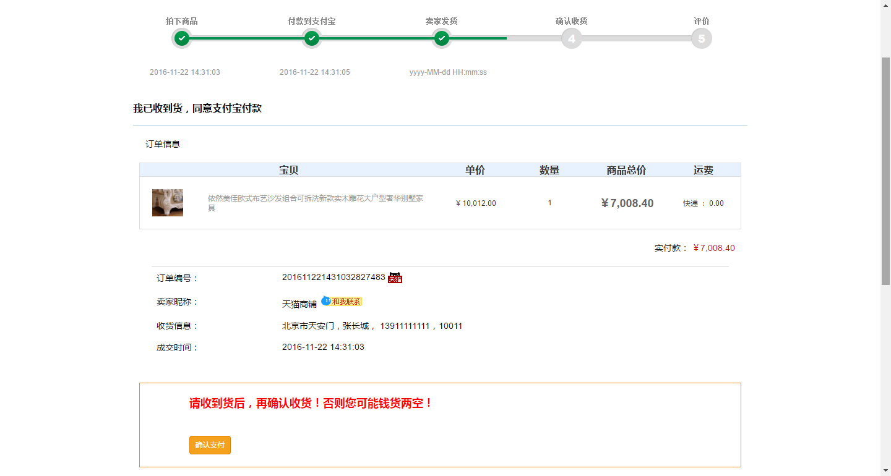

> 脚布局：

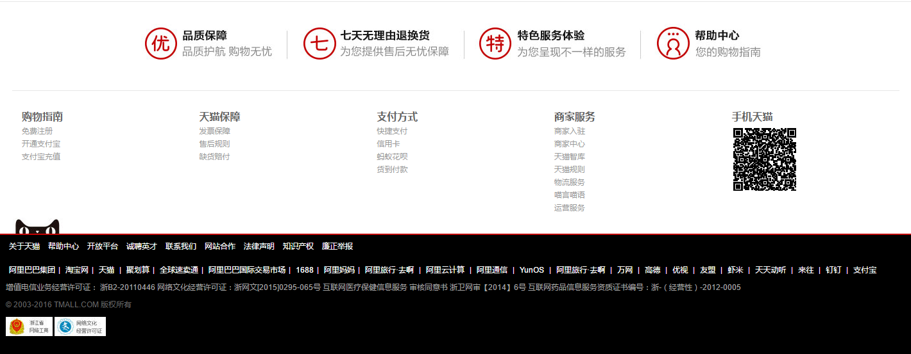

> 首页1：

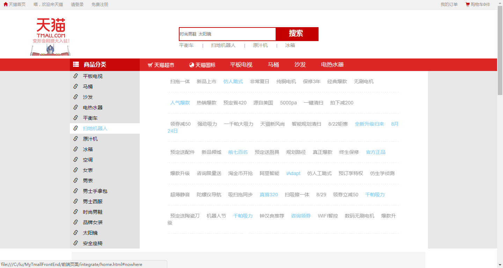

> 首页2：

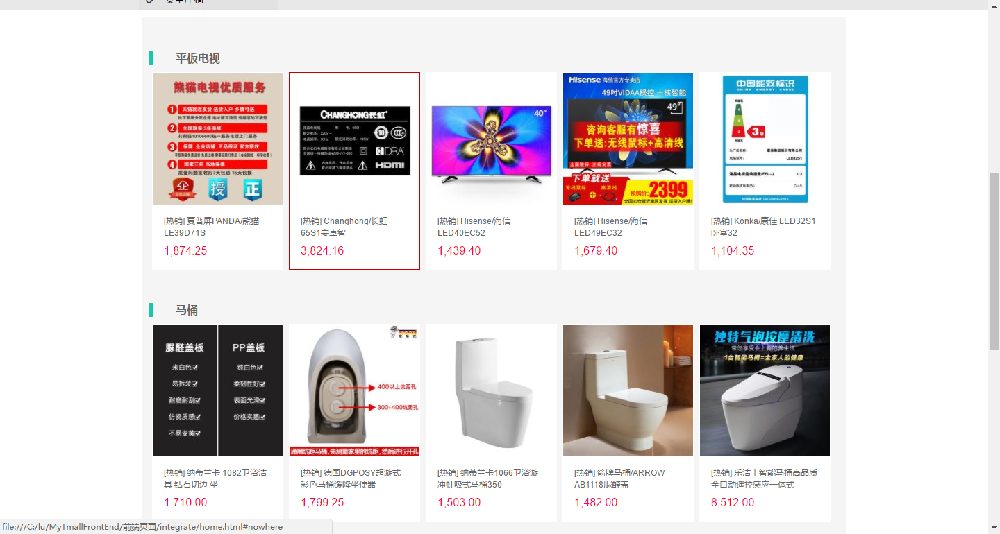

> 登录页：

> 订单页：

> 支付页：

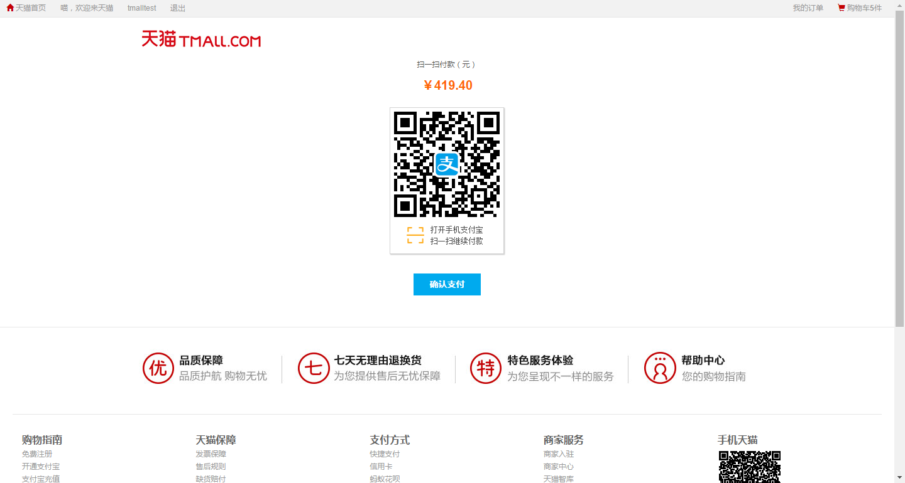

> 支付成功页：

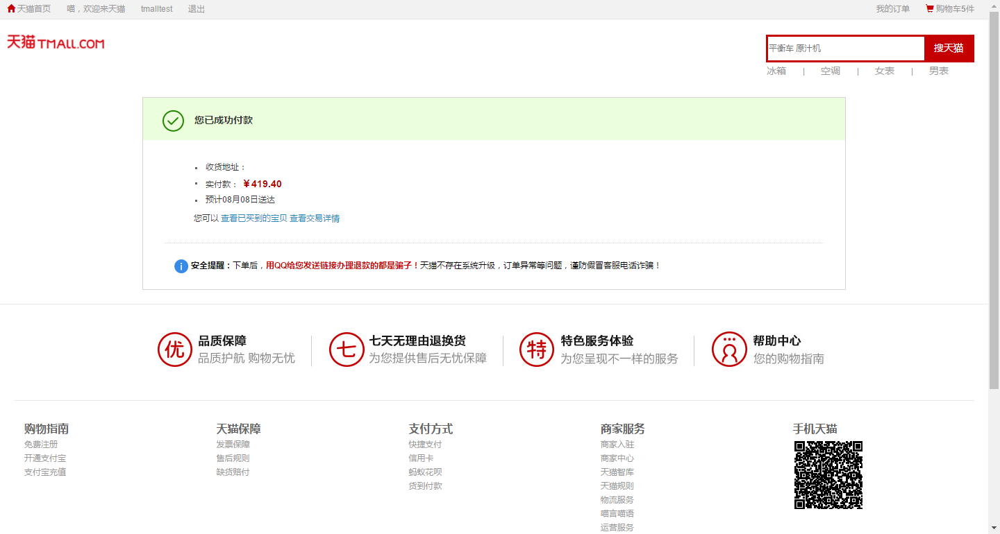

> 产品页：

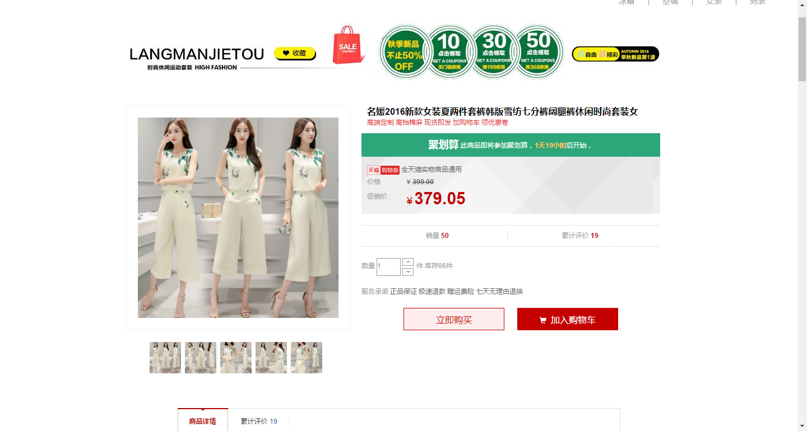

> 交易成功页：

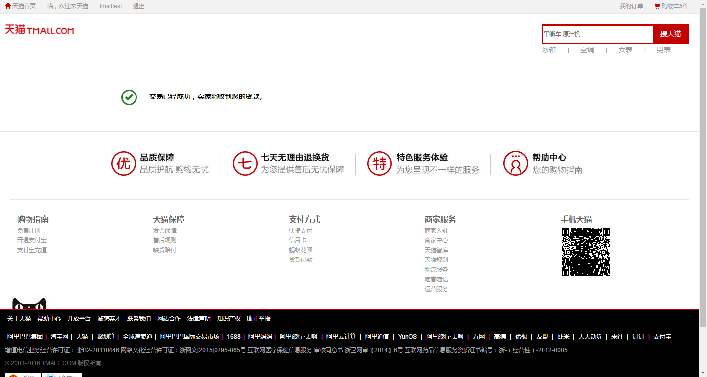

> 注册页：

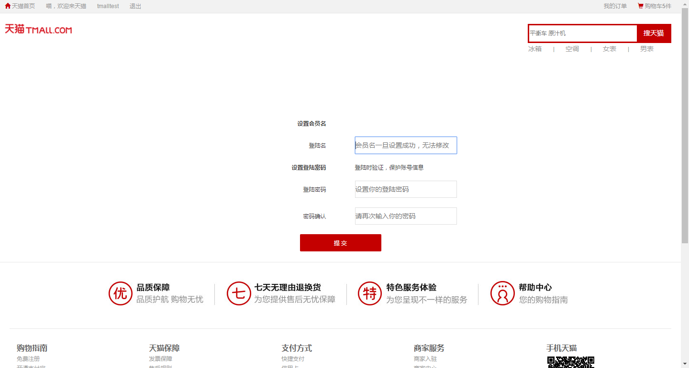

> 搜索结果页：

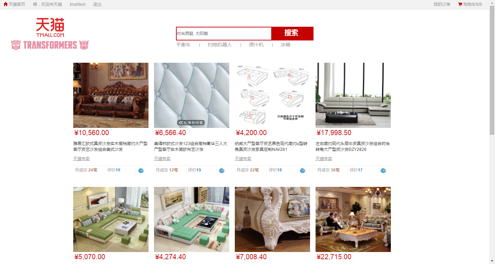

> 表关系图：

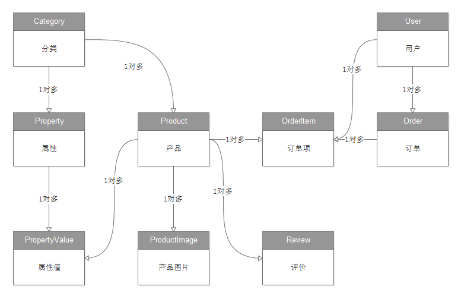

> 表含义：

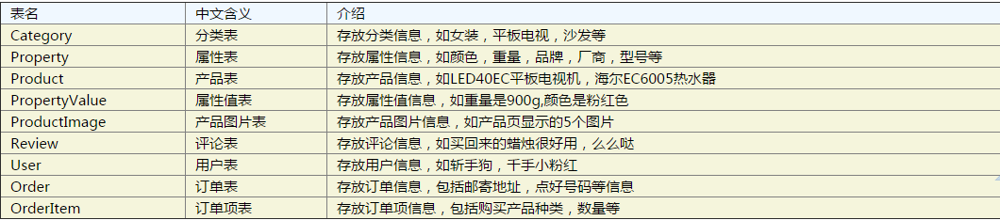

> 表对应关系：

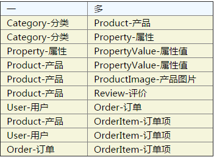

### 用户表：

>     
    CREATE TABLE user (
    id int(11) NOT NULL AUTO_INCREMENT,
	name varchar(255) DEFAULT NULL,
    password varchar(255) DEFAULT NULL,
    PRIMARY KEY (id)
    ) ENGINE=InnoDB DEFAULT CHARSET=utf8;

### 分类表:

>    
    CREATE TABLE category (
    id int(11) NOT NULL AUTO_INCREMENT,
    name varchar(255) DEFAULT NULL,
    PRIMARY KEY (id)
    ) ENGINE=InnoDB  DEFAULT CHARSET=utf8;

### 属性表:

>      
    CREATE TABLE property (
    id int(11) NOT NULL AUTO_INCREMENT,
    cid int(11) DEFAULT NULL,
    name varchar(255) DEFAULT NULL,
    PRIMARY KEY (id),
    CONSTRAINT fk_property_category FOREIGN KEY (cid) REFERENCES category (id)
    ) ENGINE=InnoDB DEFAULT CHARSET=utf8;

### 产品表:

>      
    CREATE TABLE product (
    id int(11) NOT NULL AUTO_INCREMENT,
    name varchar(255) DEFAULT NULL,
    subTitle varchar(255) DEFAULT NULL,
    orignalPrice float DEFAULT NULL,
    promotePrice float DEFAULT NULL,
    stock int(11) DEFAULT NULL,
    cid int(11) DEFAULT NULL,
    createDate datetime DEFAULT NULL,
    PRIMARY KEY (id),
    CONSTRAINT fk_product_category FOREIGN KEY (cid) REFERENCES category (id)
    ) ENGINE=InnoDB  DEFAULT CHARSET=utf8;

### 属性值表:

>      
    CREATE TABLE propertyvalue (
    id int(11) NOT NULL AUTO_INCREMENT,
    pid int(11) DEFAULT NULL,
    ptid int(11) DEFAULT NULL,
    value varchar(255) DEFAULT NULL,
    PRIMARY KEY (id),
    CONSTRAINT fk_propertyvalue_property FOREIGN KEY (ptid) REFERENCES property (id),
    CONSTRAINT fk_propertyvalue_product FOREIGN KEY (pid) REFERENCES product (id)
    ) ENGINE=InnoDB  DEFAULT CHARSET=utf8;

### 产品图片表:

>     
    CREATE TABLE productimage (
    id int(11) NOT NULL AUTO_INCREMENT,
    pid int(11) DEFAULT NULL,
    type varchar(255) DEFAULT NULL,
    PRIMARY KEY (id),
    CONSTRAINT fk_productimage_product FOREIGN KEY (pid) REFERENCES product (id)
    ) ENGINE=InnoDB DEFAULT CHARSET=utf8;

### 评价表:

>      
    CREATE TABLE review (
    id int(11) NOT NULL AUTO_INCREMENT,
    content varchar(4000) DEFAULT NULL,
    uid int(11) DEFAULT NULL,
    pid int(11) DEFAULT NULL,
    createDate datetime DEFAULT NULL,
    PRIMARY KEY (id),
    CONSTRAINT fk_review_product FOREIGN KEY (pid) REFERENCES product (id),
    CONSTRAINT fk_review_user FOREIGN KEY (uid) REFERENCES user (id)
    ) ENGINE=InnoDB  DEFAULT CHARSET=utf8;

### 订单表:

>     
    CREATE TABLE order_ (
    id int(11) NOT NULL AUTO_INCREMENT,
    orderCode varchar(255) DEFAULT NULL,
    address varchar(255) DEFAULT NULL,
    post varchar(255) DEFAULT NULL,
    receiver varchar(255) DEFAULT NULL,
    mobile varchar(255) DEFAULT NULL,
    userMessage varchar(255) DEFAULT NULL,
    createDate datetime DEFAULT NULL,
    payDate datetime DEFAULT NULL,
    deliveryDate datetime DEFAULT NULL,
    confirmDate datetime DEFAULT NULL,
    uid int(11) DEFAULT NULL,
    status varchar(255) DEFAULT NULL,
    PRIMARY KEY (id),
    CONSTRAINT fk_order_user FOREIGN KEY (uid) REFERENCES user (id)
    ) ENGINE=InnoDB  DEFAULT CHARSET=utf8;

### 订单项表:

>  
    CREATE TABLE orderitem (
    id int(11) NOT NULL AUTO_INCREMENT,
    pid int(11) DEFAULT NULL,
    oid int(11) DEFAULT NULL,
    uid int(11) DEFAULT NULL,
    number int(11) DEFAULT NULL,
    PRIMARY KEY (id),
    CONSTRAINT fk_orderitem_user FOREIGN KEY (uid) REFERENCES user (id),
    CONSTRAINT fk_orderitem_product FOREIGN KEY (pid) REFERENCES product (id)
    ) ENGINE=InnoDB  DEFAULT CHARSET=utf8;

